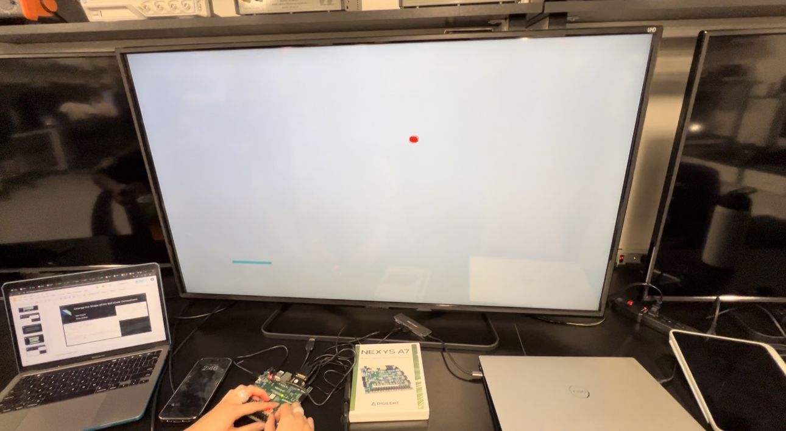
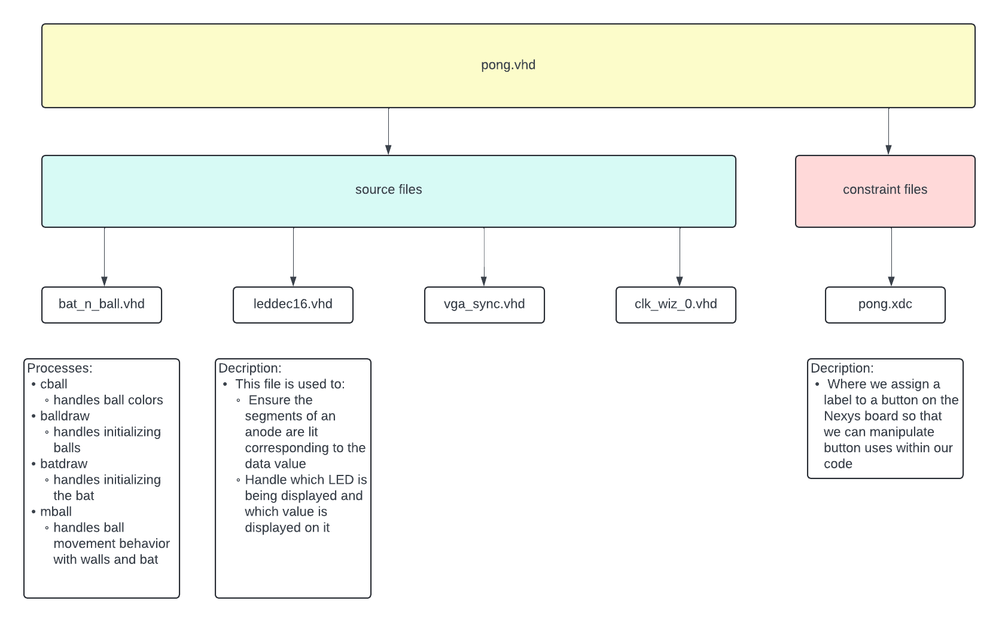
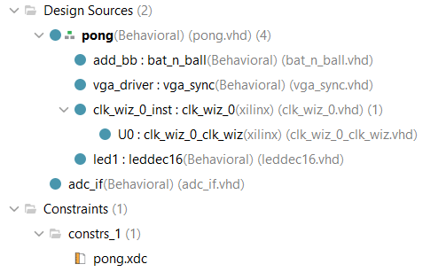
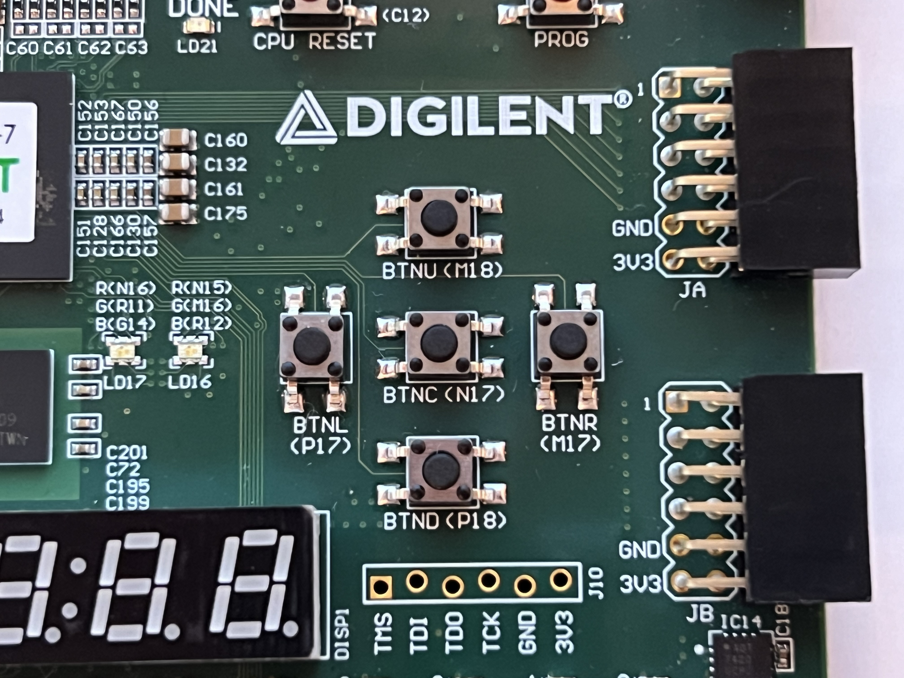
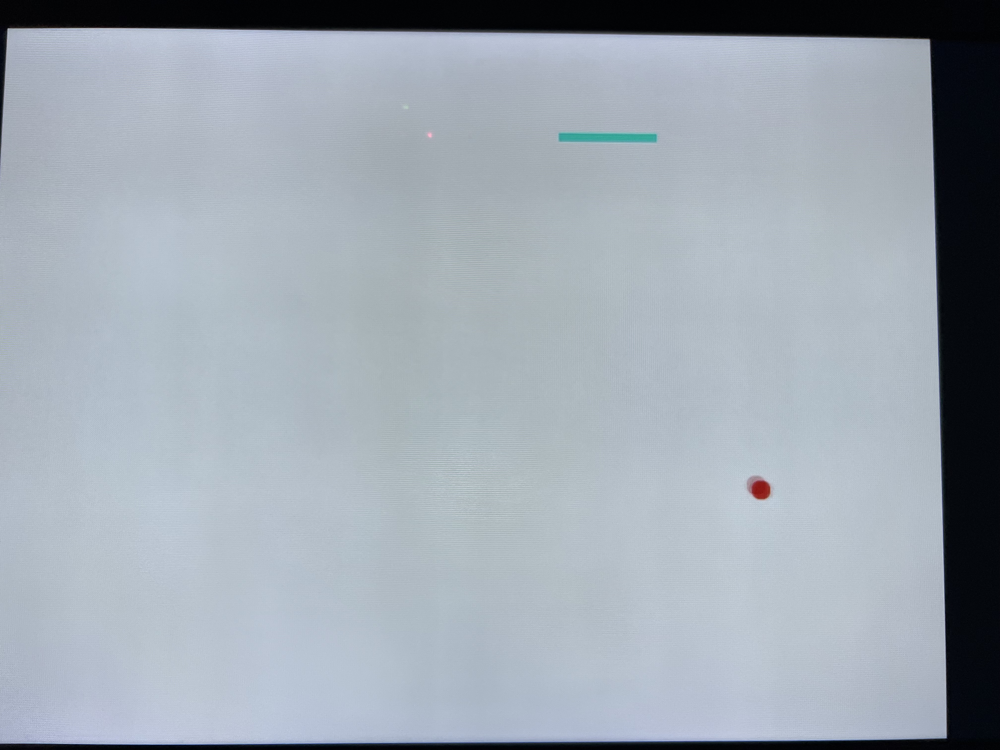
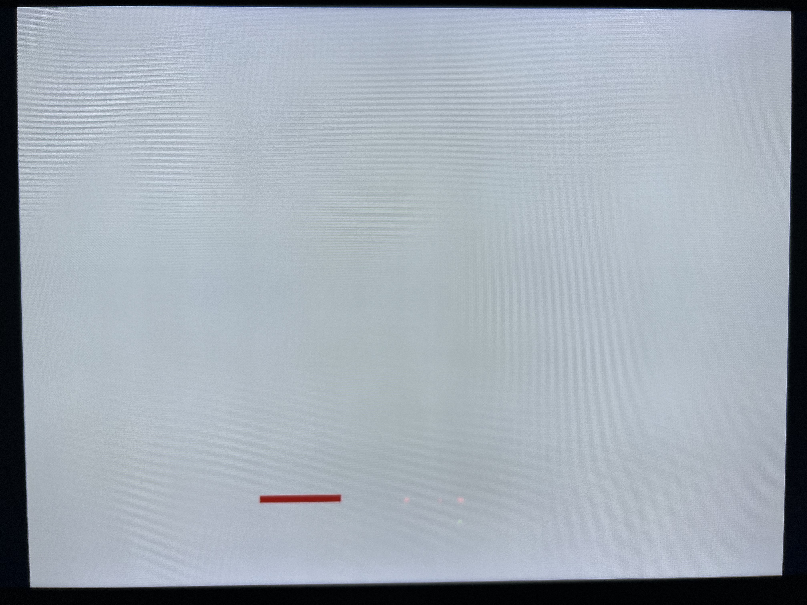
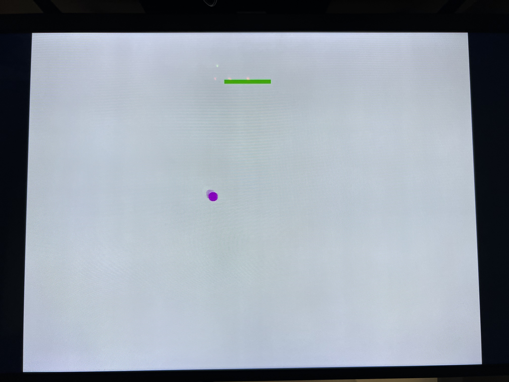

# CPE 487 - Digital System Design *Final Project*

**This project is a continuation based off the final version of Lab 6**

## Expected Behavior (10 points)

* With this project, we really wanted to improve upon the gameplay of lab 6 and enhance user experience, as well as make a few modifications to make the game more interesting. When first playing the game, three LEDs will flash on. Those will be your lives, your current level, and your score displayed from left to right. At the start of the game, you'll begin with 5 lives and start on level 1 with a score of 0. The goal of the game is to hit the ball with your bat to keep the ball from "falling" or touching the bottom of the screen. You can start the game by initializing the ball using the center button (BTNC) and you only move your bat left or right using the buttons, btnl and btnr, on the Nexys board. If you hit the ball with the bat, your score increases by 1. If you hit the ball three times, you'll level up! This means your score counter will reset back to 0 and your level counter will increase by 1. You'll also notice the speed of your ball will increase slightly each time you increase in level. To indicate your level up, the colors of the bat and ball will change from cyan and red to green and purple, respectively. As you level up, the color schemes will toggle back and forth. If you let the ball touch the bottom of the screen, the ball will disappear or "fall" and your lives will decrease by 1. If that happens, no worries! The game isn't over until you lose all your lives, just reinitialize your ball by pressing the center button.
  * Once you reach level 3, a second, much slower, ball will be added to the game. When this happens, you must keep all your balls from falling. If one of the balls hits the bottom of the screen, then both balls will disappear and you will have to initialize them again. Your lives will then decrease by 1. To accomodate for the additional ball, your bat width will double in size. This additional ball will also increase in speed as you level up.
  * If you lose all your lives, your bat will turn red, indicating game over. The game will reset, starting you back at the initial bat width, initial ball amount and initial ball speed. Your lives will be restored, but your level will go back down to one while your score will go down to zero. Pressing the center button will start the game again, turning the bat and ball to its default color scheme of cyan and red.
  * If the user wishes to quit the round in the middle of play, you can press BTNU and it will reset the game in a similiar manner to losing all your lives.
* In terms of setting up the game, you'll need attachments like a VGA connector, VGA cable, HDMI cable, VGA-to-HDMI converter, and a micro-B USB

* Below is a block diagram giving a general overview of how the files are connected in this project and the descriptions and purposes of the files that we primarily worked with


## How to Get the Project to Work in Vivado and Nexys Board (5 points)

### 1. Create a new RTL project in Vivado Quick Start
* Add six source files (file type VHDL): ***clk_wiz_0, clk_wiz_0_clk_wiz, vga_sync, bat_n_ball, adc_if,*** and ***pong***
* Create a new constraint file (file type XDC) called ***pong***
* Select Nexy A7-100T board
* Copy the VHDL code from the dsd/Nexys-A7/Lab-6 for clk_wiz_0, clk_wiz_0_clk_wiz, vga_sync.vhd, bat_n_ball.vhd, adc_if.vhd, pong_2.vhd (for the pong source file), and pong_2.xdc (for the pong constraint file)
  

### 2. Run Synthesis
### 3. Run Implementation
### 4. Generate bitstream, open hardware manager, and program device
* Click 'Program Device' then click xc7a100t_0 to download pong.bit to the Nexys A7-100T board
### 5. Initiate the game by pushing the BTNC button
* Use the BTNL and BTNR to move the bat left and right

 
 ## Description of Inputs and Outputs going from the Vivado Project to the Nexys board (10 points)
> Description of inputs from and outputs to the Nexys board from the Vivado project (10 points of the Submission category)
>  	* As part of this category, if using starter code of some kind (discussed below), you should add at least one input and at least one output appropriate to your project to demonstrate your understanding of modifying the ports of your various architectures and components in VHDL as well as the separate .xdc constraints file.

* Images and/or videos of the project in action interspersed throughout to provide context (10 points of the Submission category)
  
* There were three primary inputs that allowed this game to function: BTNC, BTNL, and BTNR. All of these were pre-existing inputs that were a part of Lab 6.
	* BTNC: initiate the game and "serve" the ball
	* BTNL: move the bat to the left
 	* BTNR: move the bat to the right\
`set_property -dict { PACKAGE_PIN N17 IOSTANDARD LVCMOS33 } [get_ports { btn0 }]; #IO_L9P_T1_DQS_14 Sch=btnc`\
`set_property -dict { PACKAGE_PIN P17 IOSTANDARD LVCMOS33 } [get_ports { btnl }]; #IO_L12P_T1_MRCC_14 Sch=btnl`\
`set_property -dict { PACKAGE_PIN M17 IOSTANDARD LVCMOS33 } [get_ports { btnr }]; #IO_L10N_T1_D15_14 Sch=btnr`


* Later on, another input (BTNU) was added to the game that served as a "kill switch" for the game. This enabled the user to end the game and reset the hit counter, level counter, and lives.
	* BTNU: resets all aspects of game, and awaits the pressing of BTNC to restart\
`set_property -dict { PACKAGE_PIN M18 IOSTANDARD LVCMOS33 } [get_ports { BTNU }];`


* The primary output modification made, was altering which display anodes were turned on from the 7-segment display. In the original Lab 6 program, anodes 0 through three were turned on to display the hit counter. For the project, we were keeping the implementation of the hit counter, while also implementing a level counter and a lives counter that were to be displayed to the user. In order for this to be practical and readable to the user, there needed to be space between the anodes that were on.
	* On anode 0, we displayed the hit counter (that would only ever count up to three before resetting to 0 when levelling up).
 	* Anodes 1 and 2 were turned off.
  	* On anode 3, we displayed the level counter. The level would increase on every third hit of the ball.
  	* Anodes 4, 5, and 6 were turned off.
  	* On anode 7, the number of lives were displayed. This would increment down by one (from five) every time the ball met the bottom wall.

````
anode <= "11111110" WHEN dig = "000" ELSE -- 0
--	         "11111101" WHEN dig = "001" ELSE -- 1
--	         "11111011" WHEN dig = "010" ELSE -- 2
	         "11110111" WHEN dig = "011" ELSE -- 3
--	         "11101111" WHEN dig = "100" ELSE -- 4
--	         "11011111" WHEN dig = "101" ELSE -- 5 
--	         "10111111" WHEN dig = "110" ELSE -- 6
	         "01111111" WHEN dig = "111" ELSE -- 7
	         "11111111";
````

## Modifications (15 points)
 

### <ins>Color Change<ins>
  * As previously mentioned, we wanted our game to have distinct color schemes on three separate occasions:
    * The default color scheme of a cyan bat and a red ball
      
    * The bat turning red when a player has lost all their lives
      
    * The alternative color scheme of a green bat and a purple ball when a player levels up
      
  * To implement these color changes, our team created a new process named "cball" or color ball and a signal named "color_control" set to an initial value of 0
    * `SIGNAL color_control : INTEGER := 0;`
  * color_control is meant to keep track of the color_scheme that is presently displayed on the screen. If color_control <= 0, then the default color scheme will display. If color_control <= 1, then the bat will turn red and the ball will turn cyan. However, because the ball will not be displayed when a player encounters "game over," the player will never see the cyan ball displayed. If color_control <= 2, then the alternative color scheme will display a green bat and a purple ball. This is implemented in the code below:
```
    cball : PROCESS (color_control, bat_on) IS
    BEGIN
    
    IF color_control = 0 THEN
    	red <= NOT bat_on;
    	green <= NOT (ball_on OR ball_on1);
    	blue <= NOT (ball_on OR ball_on1);
    ELSIF color_control = 1 THEN
        red <= NOT (ball_on OR ball_on1);
        green <= NOT bat_on;
        blue <= NOT bat_on;
    ELSIF color_control = 2 THEN
        red <= NOT bat_on;
        green <= NOT (ball_on OR ball_on1);
        blue <= NOT bat_on;
        
    END IF;

    END PROCESS;

```
   * To start the game at the default color scheme, we initialized the signal color_control = 0 (code shown previously)
   * To change the color schemes between the default and alternative when a player levels up, an if statement is implemented within the "level up" if statement. The way it works is that when a player levels up, if the default color scheme was currently displayed (color_control <= 0), then the color_control would be assigned to a new value of two (color_control <= 2) and vice versa. This is implemented in the code below:
```
	            ...
                    IF color_control = 0 THEN
                        color_control <= 2;
                    ELSIF color_control = 2 THEN
                        color_control <= 0;
                    END IF;
		    ...

```

   * To turn the bat red when the player encounters "game over," color_control is assigned to 1 (color_control <= 1) in the "game over" if statement. This is implemented in the code shown below: 

```
      IF life_control = 1 THEN
        lives <= lives - "0000000000000001";
         IF lives = "0000000000000001" THEN
            ball_speed <= "00000000100";
            ball_speed1 <= "00000000000";
            bat_w <= 40;
            score_counter <= "0000000000000000";
            lvl_counter <= "0000000000000001";
            lives <= "0000000000000101"; --5
            color_control <= 1;
            END IF;
            ...
```

* When initially implementing this code, we had assigned color_control <= 0 when the ball was initialized, or when the center button was pressed, so that the game could reset to the default color scheme after experiencing a "game over." We observed that by doing this, the default color scheme would display every time the center button was pressed. This causes issues in the case that a ball falls while the alternative color scheme is displayed. The color scheme would change when a player does not yet reach the next level. 
* To remedy this issue, our team implemented an if statement that would display the default color scheme only if the bat was previously red (color_control <= 1)
    
```
        IF serve = '1' AND game_on = '0' THEN -- test for new serve
            
            game_on <= '1';
            ball_x_motion <= (NOT ball_speed) + 1;
            ball_y_motion <= (NOT ball_speed) + 1; -- set vspeed to (- ball_speed) pixels
            score_counter_tmp <= "0000000000000000";
            score_counter_tmp1 <= "0000000000000000";
            lives_tmp <= 0;
            
            IF lvl_counter >= "0000000000000011" THEN
                game_on1 <= '1';
                ball_x_motion1 <= (NOT ball_speed1) + 1;
                ball_y_motion1 <= (NOT ball_speed1) + 1;
                --ball_speed <= "00000000100";
            END IF;
            
            IF color_control = 1 THEN
                color_control <= 0; 
            END IF;
            ...
```

### <ins>Implementing "lives"<ins>
  * Our team wanted to incorporate a lives component in our game to enhance gameplay. To do this, we created an output port "lives_display" in our bat_n_ball.vhd file. We also created two signals, "lives" and "lives_tmp." "Lives" is initialized with a value of 5 so that a player starts off with 5 lives. "Lives_tmp" is initialized at 0, the purpose in this will be explained later on
```
   ...
   lives_display: OUT std_logic_vector (15 DOWNTO 0)
   ...
   SIGNAL lives : STD_LOGIC_VECTOR(15 DOWNTO 0) := conv_std_logic_vector(5,16);
   SIGNAL lives_tmp : INTEGER := 0;
```
  * When initially implementing the lives component, we started off with simply subtracting one from the "lives" signal within the "if ball meets bottom wall" section of the code. 
    * `lives <= lives - "0000000000000001";`
  * Unfortunately, when implementing this, the "lives" value would be subtracted from twice. We suspected this was because of the clock cycles that the value would be subtracted twice even though the ball touched the bottom wall once. In an attempt to remedy this, we implemented the "lives_tmp" signal. This signal would be set to 0 (lives_tmp <= 0) any time the ball hit any of the walls other than the bottom wall. If the ball hit the bottom wall, lives_tmp would be assigned to 1 (lives_tmp <= 0). Then, in the "if ball meets bottom wall" if statement, we added an extra conditional that would require that lives_tmp <= 0, otherwise the code wouldn't run. This was done to ensure that the code wouldn't run twice. This is implemented in the code shown below:
    * ` ELSIF ball_y1 + bsize >= 600 AND lives_tmp = 0 THEN `
  * Unfortunately, this iteration didn't work as well, our lives value was still subtracting twice. Then we tried a new approach. Similar to how we implemented a color change, we created a new signal called "life_control."
    * `signal life_control : INTEGER := 0;`
  * Life_control is assigned to one when the ball touches the bottom wall. This was done so that even if the "if ball meet bottom wall" if statement is run twice, it would only set life_control to one twice, not subtract from lives twice.
```
        ELSIF ball_y1 + bsize >= 600 AND lives_tmp = 0 THEN -- if ball meets bottom wall
            ball_y_motion1 <= (NOT ball_speed) + 1; -- set vspeed to (- ball_speed) pixels
            life_control <= 1;
	    ...
```
  * To subtract one from lives, we created an if statement outside of the "if ball meet bottom wall" if statement. If life_control is assigned to one, then the lives value would be subtracted from. Then after lives is altered, life_control is assigned back to zero to keep the if statement from running again until the ball meets the bottom wall. This is implemented in the code below:
```
      IF life_control = 1 THEN
      lives <= lives - "0000000000000001";
      ...
      life_control <= 0;
      END IF;
```
  * To display the lives value, lives is assigned to lives_display
    * `lives_display <= lives;`

### <ins>Implementing "levels" and Leveling Up<ins>
  * Implenting our levels component started with creating an output port "lvl_display" and a signal "lvl_counter." Lvl_counter starts at an initial value of one as most games start at level one.
```
	...
        lvl_display : OUT std_logic_vector (15 DOWNTO 0);
	...
	SIGNAL lvl_counter : std_logic_vector (15 DOWNTO 0):= conv_std_logic_vector(1,16);
	...
```
  * For our game, we wanted our players to level up every three hits, so in the "allow for bounce off bat" if statement, we created a "level up" if statement where the conditonal is score_counter = "0000000000000010" ( or 2 in decimal). The conditional is set to 2 and not 3 because when we initially had it set to three, the game would level up after four hits and not three.
  * Within the "level up" if statement, the player's score would be reset to 0, their level would increase by 1, your ball speed(s) would increase slightly and the color scheme would change. These changes are implemented in the code below:
```
                IF score_counter = "0000000000000010" THEN
                    score_counter <= "0000000000000000";
                    lvl_counter <= lvl_counter + "0000000000000001";
		    ...
                    ball_speed <= ball_speed + "00000000001";
                    ball_speed1 <= ball_speed1 + "00000000001";
                    IF color_control = 0 THEN
                        color_control <= 2;
                    ELSIF color_control = 2 THEN
                        color_control <= 0;
                    END IF;
		END IF;
		...
```
  * The lvl_counter is displayed by assigning it to lvl_display
    * `lvl_display <= lvl_counter;`

### <ins>Displaying Level Counter, Life Counter, and Score Counter<ins>
  * The implementation of this modification starts in our ledded16.vhd file. First, we commented out some lines so only LEDs 0, 3, and 7 would display. From left to right, these LEDs would display the lives, lvl_counter, and score_counter. We created two input ports called "data_lvl" and "data_lives" to mimic the behavior of the input port "data," which currently displays the score counter.


    * ` data_lvl : IN STD_LOGIC_VECTOR (15 DOWNTO 0); `
    * ` data_lives : IN STD_LOGIC_VECTOR (15 DOWNTO 0); `
  * We came to understand that the data is dispersed to specific LEDs through "data4." We then utilized this information to assign data_lvl to LED 3 and data_lives to LED 7 so that they can display the level value and lives value respectively. This is implemented in the code below:
```
	data4 <= data(3 DOWNTO 0) WHEN dig = "000" ELSE -- digit 0
	         data_lvl(3 DOWNTO 0) WHEN dig = "011" ELSE -- digit 1
	         data_lives(3 DOWNTO 0) WHEN dig = "111" ELSE -- digit 2
	         data(15 DOWNTO 12); -- digit 3
	         --data(19 DOWNTO 16) WHEN dig = "100"

```
  * After this, we only had to create signals and ports that would mimic the original code to display score_counter in pong.vhd and bat_n_ball.vhd.
  * In the pong.vhd file, we created the following ports and signals:
    
```
ARCHITECTURE Behavioral OF pong IS
    ...
    SIGNAL display_lives : std_logic_vector (15 DOWNTO 0); -- value to be displayed
    SIGNAL display_lvl : std_logic_vector (15 DOWNTO 0); -- value to be displayed
    ...
    COMPONENT bat_n_ball IS
        PORT (
        ...
            lvl_display : OUT std_logic_vector (15 DOWNTO 0);
            lives_display: OUT std_logic_vector (15 DOWNTO 0)
	    ...
    COMPONENT leddec16 IS
        PORT (
	...
            data_lvl : IN STD_LOGIC_VECTOR (15 DOWNTO 0);
            data_lives : IN STD_LOGIC_VECTOR (15 DOWNTO 0);
	    ...
```
  * These ports were implemented in their corresponding files as well.
  * Finally, to connect the data created in vivado and display it on the LEDs, you must assign the data and LED to the same signal. This is shown below:
```
    add_bb : bat_n_ball
    PORT MAP(--instantiate bat and ball component
    ...
        lvl_display => display_lvl, 
        lives_display => display_lives
    );
    ...
    led1 : leddec16
    PORT MAP(
      dig => led_mpx, data => display, data_lvl => display_lvl, data_lives => display_lives,
      ...
```
### <ins>Initializing Second Ball<ins>
* One aspect of our game was to add a second ball once the user reached level 3. One ball would be going rather slow while the other remained at a quicker pace. Due to the added difficulty of the second ball we also decided to double the bat size when reaching level 3.
* In order to accomplish this, we had to duplicate all signals that impacted the play of the ball, which included: ball speed, turning the ball on/off, turning the game on/off, the position of the ball in both the x and y directions, and the motion of the ball in the x and y directions.
  ````
    SIGNAL ball_speed : STD_LOGIC_VECTOR(10 DOWNTO 0) := CONV_STD_LOGIC_VECTOR (4, 11); 
    SIGNAL ball_speed1 : STD_LOGIC_VECTOR(10 DOWNTO 0) := CONV_STD_LOGIC_VECTOR (1, 11);
    SIGNAL ball_on : STD_LOGIC; -- indicates whether ball is at current pixel position
    SIGNAL ball_on1: STD_LOGIC;
    SIGNAL bat_on : STD_LOGIC; -- indicates whether bat at over current pixel position
    SIGNAL game_on : STD_LOGIC := '0'; -- indicates whether ball is in play
    SIGNAL game_on1 : STD_LOGIC := '0';
    ...
    SIGNAL ball_x : STD_LOGIC_VECTOR(10 DOWNTO 0) := CONV_STD_LOGIC_VECTOR(400, 11);
    SIGNAL ball_y : STD_LOGIC_VECTOR(10 DOWNTO 0) := CONV_STD_LOGIC_VECTOR(300, 11);
    SIGNAL ball_x1 : STD_LOGIC_VECTOR(10 DOWNTO 0) := CONV_STD_LOGIC_VECTOR(400, 11);
    SIGNAL ball_y1 : STD_LOGIC_VECTOR(10 DOWNTO 0) := CONV_STD_LOGIC_VECTOR(300, 11);
    ...
    SIGNAL ball_x_motion, ball_y_motion : STD_LOGIC_VECTOR(10 DOWNTO 0) := ball_speed;
    SIGNAL ball_x_motion1, ball_y_motion1 : STD_LOGIC_VECTOR(10 DOWNTO 0) := ball_speed;
  ````
	* Everything denoted *xxx*1 is a signal that is utilized in the implementation of the second ball.
  ````
  -- second ball
        IF pixel_col <= ball_x1 THEN -- vx = |ball_x - pixel_col|
            vx := ball_x1 - pixel_col;
        ELSE
            vx := pixel_col - ball_x1;
        END IF;
        IF pixel_row <= ball_y1 THEN -- vy = |ball_y - pixel_row|
            vy := ball_y1 - pixel_row;
        ELSE
            vy := pixel_row - ball_y1;
        END IF;
        IF ((vx * vx) + (vy * vy)) < (bsize * bsize) THEN -- test if radial distance < bsize
            ball_on1 <= game_on1;
        ELSE
            ball_on1 <= '0';
        END IF;
  ````
	* This process follows the same steps as the first ball. It is essentially setting all of the parameters to draw the ball. Firstly, it is setting the vertical bounds for the ball, then the horizontal bounds (without the last if statement, would draw a square), and finally bounds the circle with its radius. If a pixel falls within the bounds of the circle, then it turns on that pixel when the game is initiated.
 		* ball_x1, ball_y1: the x and y position of the second ball
		* ball_on1, game_on1: allows the second ball to be switched on when game_on1 is switched on when the user reaches level 3
* We have game_on1 <= '1' in two instances:
	1. When serve = '1' (when BTNC is pressed). This makes sure that if the user is at level 3 or above and the ball meets the bottom wall, but there are still lives remaining, the user will still have two balls in play when serving the ball again.
		```
		IF lvl_counter >= "0000000000000011" THEN
			game_on1 <= '1';
			ball_x_motion1 <= (NOT ball_speed1) + 1;
			ball_y_motion1 <= (NOT ball_speed1) + 1;
		    END IF;
		```	
	2. When the first ball bounces off of the bat, we check the level counter, and if it's on level 3, then we turn on the second ball.
		```
  		IF lvl_counter = "0000000000000010" THEN
                        bat_w <= 80;
                        ball_speed <= "00000000001";
                        ball_speed1 <= "00000000001";
                        game_on1 <= '1';
                        ball_x_motion1 <= (NOT ball_speed1) + 1;
                        ball_y_motion1 <= (NOT ball_speed1) + 1;
                    END IF;
  		```  
* Once the second ball is turned on, we follow the same parameters as the original ball: bounce the ball off the top wall, right wall, and left wall, and turn the ball off if it meets the bottom wall.
	* Top wall:
		````
		ELSIF ball_y1 <= bsize THEN -- bounce off top wall
		    ball_y_motion1 <= ball_speed; -- set vspeed to (+ ball_speed) pixels
		    score_counter_tmp1 <= "0000000000000000";
		    lives_tmp <= 0;
		````
   * Right and left walls:
		````
		IF ball_x1 + bsize >= 800 THEN -- bounce off right wall
		    ball_x_motion1 <= (NOT ball_speed1) + 1; -- set hspeed to (- ball_speed) pixels
		    score_counter_tmp1 <= "0000000000000000";
		    lives_tmp <= 0;
		ELSIF ball_x1 <= bsize THEN -- bounce off left wall
		    score_counter_tmp1 <= "0000000000000000";
		    lives_tmp <= 0;
		    ball_x_motion1 <= ball_speed1; -- set hspeed to (+ ball_speed) pixels
		END IF;
		````
* One issue we ran into when implementing the second ball was that one of the two balls would go through the bat. At first we believed it was a glitch, however, we quickly realized that it was happening much to frequently to be just a glitch. The issue turned out to be a lack of a temporary counter variable for the second ball. Without a score_counter_tmp1, the second ball to "impact" the bat would pass through unless the first ball had impacted a wall to cause the original score_counter_tmp to be zero.
	```
	SIGNAL score_counter_tmp : std_logic_vector(15 DOWNTO 0);
	SIGNAL score_counter_tmp1 : std_logic_vector(15 DOWNTO 0);
	```
 	* We created the score_counter_tmp1 signal, and this was implemented everywhere the original score_counter_tmp was implemented to remedy this issue.
* Another issue we encountered was when one ball met the bottom wall, it would subtract a life, but then when the second ball met the bottom wall, it would subtract another life. If it was the last life, the first ball would hit the bottom wall, the bat would turn red, and the game would reset, but then the second ball would meet the bottom wall and subtract from the lives for the next round. So the user would start the next round with 4 lives.
	```
 	ELSIF ball_y + bsize >= 600 AND lives_tmp = 0 THEN -- if ball meets bottom wall
            ball_y_motion <= (NOT ball_speed) + 1; -- set vspeed to (- ball_speed) pixels
            life_control <= 1;
            lives_tmp <= 1;
            lives_tmp <= 0;
            game_on <= '0'; -- and make ball disappear
            game_on1 <= '0';
            score_counter_tmp <= "0000000000000000";
            
 	ELSIF ball_y1 + bsize >= 600 AND lives_tmp = 0 THEN -- if ball meets bottom wall
            ball_y_motion1 <= (NOT ball_speed) + 1; -- set vspeed to (- ball_speed) pixels
            life_control <= 1;
            lives_tmp <= 1;
            lives_tmp <= 0;
            game_on1 <= '0'; -- and make ball disappear
            game_on <= '0';
            score_counter_tmp1 <= "0000000000000000";
 	```
	* To remedy this, we set both game_on and game_on1 to 0 to turn off the first and second ball regardless of which one hits the bottom wall first. This corrected the double subtraction of lives.
* Ultimately, we decided to stop after adding a second ball. The game was already rather difficult as is, so we thought that adding a third or more balls would cause the game to be nearly unplayable. However, if we were to implement a third ball, we would follow a similar process to how we implemented the second one. We would need to start with duplicating all of the necessary signals again. Then we would need set the parameters for the third ball to be drawn and to allow the ball to bounce off all of the walls. We would also need to implement some sort of IF statement where the "serve" occurs so we can set when the third ball would appear (for example, the 6th level). We would need to create another IF statement to subtract lives if the third ball met the bottom wall, as well as turning off the ball when any of the balls meet the bottom wall to avoid our first issue with subtracting too many lives. To avoid the issue of the ball going through the bat, we would need to implement another temporary variable. The same can be done for adding a fourth, fifth, etc. ball. 

### <ins>Implementing a "game over" and Reset<ins>
* To implement our "game over" we worked mostly in the "life control" if statement (as previously mentioned in the lives modification)
* We created an if statement with the condition that lives was equal to 1 (lives = "0000000000000001"). Initially, the condition was lives = 0000000000000000 ( or 0 in decimal), however, the "game over" changes didn't implement until after the ball "fell" whilst lives = 0000000000000000. To accomodate for this, the condition was set to lives = "0000000000000001". Once "game over" was reached, the game resets. This means ball speed(s), bat width, score_counter, lvl_counter, and lives were reset to their initial values, respectively. The bat also turns red to indicate "game over." These changes are implemented in the code below:
```
      IF life_control = 1 THEN
        lives <= lives - "0000000000000001";
         IF lives = "0000000000000001" THEN
            ball_speed <= "00000000100";
            ball_speed1 <= "00000000000";
            bat_w <= 40;
            score_counter <= "0000000000000000";
            lvl_counter <= "0000000000000001";
            lives <= "0000000000000101"; --5
            color_control <= 1;
           END IF;
	   ...
```
### <ins>Implement "kill switch"<ins>
* The purpose of the "kill switch" was to give the user the option to stop the game in the middle of playing and have it reset for the next user.
* We utilized the BTNU button to stop the game when pressed. This can occur when one or both balls are active or when the game is paused between lives. When the button is pressed it resets the game in a similar manner to when the game is over.

 * To implement the BTNU button so it's input could be used for the game, we had to initialize BTNU:
   	1. In the top file (pong.vhd):
   		* In the pong entity:
   			````
   	  		ENTITY pong IS
			    PORT (
				...
				BTNU : IN STD_LOGIC
			    ); 
			END pong;
   	  		````
   	  	* In the bat_n_ball component port:
			````
			COMPONENT bat_n_ball IS
				PORT (
				    ...
				    BTNU : IN STD_LOGIC
				);
			````
   	     * In the bat_n_ball portmap:
			````
			add_bb : bat_n_ball
			PORT MAP(--instantiate bat and ball component
			    ...
			    BTNU => BTNU
			);
			````
   	2. In bat_n_ball.vhd:
   		* In bat_n_ball entity port:
   			````
			ENTITY bat_n_ball IS
			    PORT (
			        ...
			        BTNU : IN STD_LOGIC
			    );
   	  		````
   	  	* Implementation used to stop game:
			````
			IF BTNU = '1' THEN
			    game_on <= '0';
			    game_on1 <= '0';
			    ball_speed <= "00000000100";
			    ball_speed1 <= "00000000000";
			    bat_w <= 40;
			    score_counter <= "0000000000000000";
			    lvl_counter <= "0000000000000001";
			    lives <= "0000000000000101"; --5
			    color_control <= 1;
			END IF;
			````
   	3. In the constraint file (pong.xdc):
   	   ``set_property -dict { PACKAGE_PIN M18 IOSTANDARD LVCMOS33 } [get_ports { BTNU }];``

## Summary (10 points)

* To conclude, we created a game that was an expansion on Lab-6. Our game utilized lives and levels, both of which were shown on the Nexys A7-100T as well as a score counter that counted up to 3 before going back to 0, indicating a level up. When the user leveled up, the ball speed would increase. In addition to the score counter becoming zero and the level counter incrementing to 1, the user is also notified of a level change by the bat and ball both changing in color. An increase in level also causes an increase of speed. If the user gets to level 3, then a second ball will be added at a slower speed and the bat size will double. Both balls must remain in play, otherwise you will lose a life. Starting with five lives, once the user reaches 0, the bat will turn red as an indication that the game is now over, and the lives, level, and counter all reset. If the user wishes to quit the game in the middle of play, they may press BTNU to stop the game and have it reset for the next user. 

* Because Bao-Chau uses a mac, she was unable to download Vivado, and as a result all of the work was done on Ella’s laptop. We made sure to meet in the lab as much as possible to combat this limitation. Overall most of this project was completed by both Bao-Chau and Ella working together in the lab. However, the color toggling process and displaying the lives and levels were implemented by Bao-Chau on her own, and the “kill-switch” was implemented by Ella on her own. On Day 1 of working on the project, the first task that was completed was limiting the score_counter to 3 and implementing the lvl_counter and lives counter. Originally, we started with 3 lives, however, we quickly realized that the game was rather difficult, so we changed the maximum lives to 5. We tried to display these values on the LEDS, however, our initial implementations failed synthesis multiple times. We decided to pin LEDs displays until later and move on to implementing colors on Day 2. On Day 2, we ran into an issue implementing the different color schemes. While our code had passed synthesis, our implementation was failing. This was the first time we encountered a failed implementation so we were unsure of where it went wrong. Ella had to step out for a few hours that day, so Bao-Chau stayed in the lab to try and fix this issue. After discussion with the Professor, Bao-Chau realized that the issue remained in the fact that their code had attempted to change the red, blue, and green multiple times, simultaneously. That was why synthesis was successful, but implementation was not. To remedy this issue, Bao-Chau had created an if statement for each color scheme so that the colors could only be changed once in one clock cycle. Bao-Chau also began working on displaying the lvl_counter and lives value on the LEDs. The issue in our previous attempt at displaying these values was that we didn’t fully understand how data from the bat_n_ball.vhd file and data from the leddec16.vhd were connected. Again, Bao-Chau had spoken to the Professor, and he was able to explain how the original leddec16.vhd file worked. Using this information, Bao-Chau created new ports and signals specific to lvl_counter and the lives counter to mimic the use of “data” and “display.” More details on how the display was successfully implemented can be found in the Modifications section of this report. At this point, Ella had returned and we began working on fixing the lives counter. When playing the game, the life counter would decrease by two instead of one. We realized this may be because when the ball hits the bottom of the wall, the code for decreasing the lives counter would run twice due to the clock cycles running twice. We were able to fix this issue by implementing an if statement outside of the original “if ball meets bottom wall” if statement. More details on how we fixed this issue can be found in the Modifications section of this report. On Day 3, we implemented a second ball that would appear when the user reached level 3. This ball would start slow and increase in speed (like the other ball). When implementing this second ball, sometimes one of the balls would pass through the bat. We realized this occurred because we did not implement a temp signal specific to the second ball and let both balls use the same temp signal. To rectify this issue, we simply created a temp variable that was specific to the second ball. For more details on how we did this, please see the Modifications section of this report. Lastly, Ella implemented the BTNU button to allow the user to stop the game whenever they chose. This was a more last minute decision to allow an easy restart to improve user experience. 

* Along the way, we encountered many issues with most of the major modifications that we implemented.  Some of these issues are outlined and elaborated on in their respective “modification” section. Also in its respective “modification” section, we discussed the possibility of implementing an additional ball or more into the game as well as how we would go about that implementation. Some minor errors are detailed in the Modifications section, however those issues were not mentioned here as they were not errors due to a lack of understanding, but simply fine tuning the finishing product.
