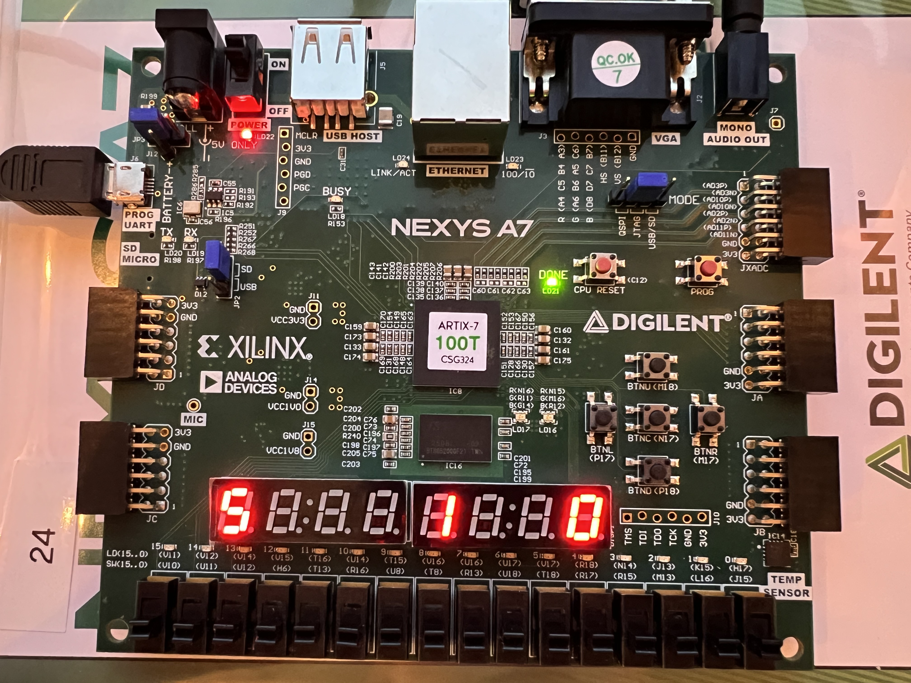

# CPE 487 - Digital System Design *Final Project*

## Submission (80% of your project grade):
* Your final submission should be a github repository of very similar format to the labs themselves with an opening README document with the expected components as follows:

## Expected Behavior (10 points)
* A description of the expected behavior of the project, attachments needed (speaker module, VGA connector, etc.), related images/diagrams, etc. (10 points of the Submission category)
  * The more detailed the better – you all know how much I love a good finite state machine and Boolean logic, so those could be some good ideas if appropriate for your system. If not, some kind of high level block diagram showing how different parts of your program connect together and/or showing how what you have created might fit into a more complete system could be appropriate instead.

* With this project, we really wanted to improve upon the gameplay of lab 6 and enhance user experience, as well as make a few modifications to make the game more interesting. When first playing the game, three LEDs will flash on. Those will be your lives, your current level, and your score displayed from left to right. At the start of the game, you'll begin with 5 lives and start on level 1 with a score of 0. The goal of the game is to hit the ball with your bat to keep the ball from "falling" or touching the bottom of the screen. You can start the game by initializing the ball using the center button and you only move your bat left or right using the buttons, btnl and btnr, on the Nexys board. If you hit the ball with the bat, your score increases by 1. If you hit the ball three times, you'll level up! This means your score counter will reset back to 0 and your level counter will increase by 1. You'll also notice the speed of your ball will increase slightly each time you increase in level. To indicate your level up, the colors of the bat and ball will change from cyan and red to green and purple, respectively. As you level up, the color schemes will toggle back and forth. If you let the ball touch the bottom of the screen, the ball will disappear or "fall" and your lives will decrease by 1. If that happens, no worries! The game isn't over until you lose all your lives, just reinitialize your ball by pressing the center button.
  * Once you reach level 3, a second ,much slower, ball will be added to the game. When this happens, you must keep all your balls from falling. If one of the balls hits the bottom of the screen, then both balls will disappear and you will have to initialize them again. Your lives will then decrease by 1. To accomodate for the additional ball, your bat width will double in size. This additional ball will also increase in speed as you level up.
  * If you lose all your lives, your bat will turn red, indicating game over. The game will reset, starting you back at the initial bat width, initial ball amount and initial ball speed. Your lives will be restored, but your level will go back down to one while your score will go down to zero. Pressing the center button will start the game again, turning the bat and ball to its default color scheme of cyan and red. 
* In terms of setting up the game, you'll need attachments like a VGA connector, VGA cable, HDMI cable, VGA-to-HDMI converter, and a micro-B USB
 


## How to Get the Project to Work in Vivado and Nexys Board (5 points)
* A summary of the steps to get the project to work in Vivado and on the Nexys board (5 points of the Submission category)

### 1. Create a new RTL project in Vivado Quick Start
* Add six source files (file type VHDL): ***clk_wiz_0, clk_wiz_0_clk_wiz, vga_sync, bat_n_ball, adc_if,*** and ***pong***
* Create a new constraint file (file type XDC) called ***pong***
* Select Nexy A7-100T board
* Copy the VHDL code from the dsd/Nexys-A7/Lab-6 for clk_wiz_0, clk_wiz_0_clk_wiz, vga_sync.vhd, bat_n_ball.vhd, adc_if.vhd, pong_2.vhd (for the pong source file), and pong_2.xdc (for the pong constraint file) 
### 2. Run Synthesis
### 3. Run Implementation
### 4. Generate bitstream, open hardware manager, and program device
* Click 'Program Device' then click xc7a100t_0 to download pong.bit to the Nexys A7-100T board
### 5. Initiate the game by pushing the BTNC button
* Use the BTNL and BTNR to move the bat left and right
 
 ## Description of Inputs and Outputs going from the Vivado Project to the Nexys board (10 points)
 * Description of inputs from and outputs to the Nexys board from the Vivado project (10 points of the Submission category)
  	* As part of this category, if using starter code of some kind (discussed below), you should add at least one input and at least one output appropriate to your project to demonstrate your understanding of modifying the ports of your various architectures and components in VHDL as well as the separate .xdc constraints file.

* Images and/or videos of the project in action interspersed throughout to provide context (10 points of the Submission category)
  
* There were three primary inputs that allowed this game to function: BTNC, BTNL, and BTNR. All of these were pre-existing inputs that were a part of Lab 6.
	* BTNC: initiate the game and "serve" the ball
	* BTNL: move the bat to the left
 	* BTNR: move the bat to the right\
`set_property -dict { PACKAGE_PIN N17 IOSTANDARD LVCMOS33 } [get_ports { btn0 }]; #IO_L9P_T1_DQS_14 Sch=btnc`\
`set_property -dict { PACKAGE_PIN P17 IOSTANDARD LVCMOS33 } [get_ports { btnl }]; #IO_L12P_T1_MRCC_14 Sch=btnl`\
`set_property -dict { PACKAGE_PIN M17 IOSTANDARD LVCMOS33 } [get_ports { btnr }]; #IO_L10N_T1_D15_14 Sch=btnr`

* Later on, another input (BTNU) was added to the game that served as a "kill switch" for the game. This enabled the user to end the game and reset the hit counter, level counter, and lives.
	* BTNU: resets all aspects of game, and awaits the pressing of BTNC to restart\
`set_property -dict { PACKAGE_PIN M18 IOSTANDARD LVCMOS33 } [get_ports { BTNU }];`

* The primary output modification made, was altering which display anodes were turned on from the 7-segment display. In the original Lab 6 program, anodes 0 through three were turned on to display the hit counter. For the project, we were keeping the implementation of the hit counter, while also implementing a level counter and a lives counter that were to be displayed to the user. In order for this to be practical and readable to the user, there needed to be space between the anodes that were on.
	* On anode 0, we displayed the hit counter (that would only ever count up to three before resetting to 0 when levelling up).
 	* Anodes 1 and 2 were turned off.
  	* On anode 3, we displayed the level counter. The level would increase on every third hit of the ball.
  	* Anodes 4, 5, and 6 were turned off.
  	* On anode 7, the number of lives were displayed. This would increment down by one (from five) every time the ball met the bottom wall.

````
anode <= "11111110" WHEN dig = "000" ELSE -- 0
--	         "11111101" WHEN dig = "001" ELSE -- 1
--	         "11111011" WHEN dig = "010" ELSE -- 2
	         "11110111" WHEN dig = "011" ELSE -- 3
--	         "11101111" WHEN dig = "100" ELSE -- 4
--	         "11011111" WHEN dig = "101" ELSE -- 5 
--	         "10111111" WHEN dig = "110" ELSE -- 6
	         "01111111" WHEN dig = "111" ELSE -- 7
	         "11111111";
````

## Modifications (15 points)
* “Modifications” (15 points of the Submission category)
  * If building on an existing lab or expansive starter code of some kind, describe your “modifications” – the changes made to that starter code to improve the code, create entirely new functionalities, etc. Unless you were starting from one of the labs, please share any starter code used as well, including crediting the creator(s) of any code used. It is perfectly ok to start with a lab or other code you find as a baseline, but you will be judged on your contributions on top of that pre-existing code!
	* If you truly created your code/project from scratch, summarize that process here in place of the above.
 

* Color Change
* initializing a second ball at level three
* implementing "lives"
* implementing "levels" and level up
* displaying level counter, life counter, and score counter
* implementing a "game over" and reset
* ball speed increase
* implement "kill switch"

## Summary (10 points)
* Conclude with a summary of the process itself – who was responsible for what components (preferably also shown by each person contributing to the github repository!), the timeline of work completed, any difficulties encountered and how they were solved, etc. (10 points of the Submission category)


* And of course, the code itself separated into appropriate .vhd and .xdc files. (50 points of the Submission category; based on the code working, code complexity, quantity/quality of modifications, etc.)

	* This is a group assignment, and for the most part you are graded as a group. I reserve the right to modify single student grades for extenuating circumstances, such as a clear lack of participation from a group member. You are allowed to rely on the expertise of your group members in certain aspects of the project, but you should all have at least a cursory understanding of all aspects of your project.
